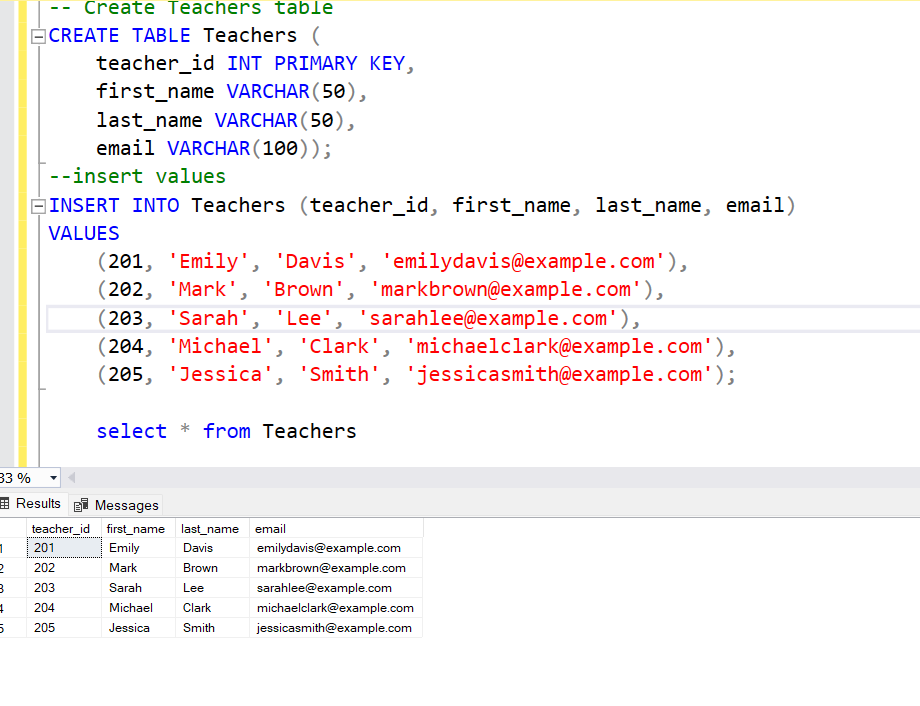
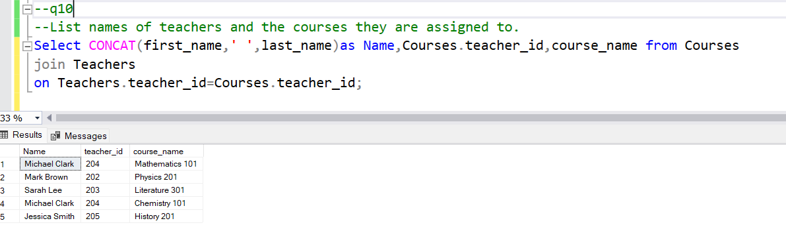

### Assignemnt 1

## Creation of Database-

create database Assignment;

use Assignment;

## Creation of Tables -

Tables are created and values are added according to the given requirements

**Syntax Table 1 -**

-- Create Students table

```sql
CREATE TABLE Students (
student_id INT PRIMARY KEY,
first_name VARCHAR(50),
last_name VARCHAR(50),
date_of_birth DATE,
email VARCHAR(100),
phone_number VARCHAR(20));
-- insert values

INSERT INTO Students (student_id, first_name, last_name, date_of_birth, email, phone_number)
VALUES

    (1, 'Jane', 'Smith', '1997-08-21', 'janesmith@outlook.com', '1987654321'),
    (2, 'Michael', 'Johnson', '1996-11-10', 'michaeljohnson@outlook.com', '1765432109'),
    (3, 'Emily', 'Brown', '1998-04-25', 'emilybrown@outlook.com', '1654321897'),
    (4, 'David', 'Wilson', '1994-09-08', 'davidwilson@outlook.com', '1876543210'),
    (5, 'Sophia', 'Miller', '1999-12-30', 'sophiamiller@outlook.com', '1987654321');
```


**Syntax Table 2-**

```sql
-- Create Teachers table

CREATE TABLE Teachers (
teacher_id INT PRIMARY KEY,
first_name VARCHAR(50),
last_name VARCHAR(50),
email VARCHAR(100));

--insert values

INSERT INTO Teachers (teacher_id, first_name, last_name, email)
VALUES

    (201, 'Emily', 'Davis', 'emilydavis@outlook.com'),
    (202, 'Mark', 'Brown', 'markbrown@outlook.com'),
    (203, 'Sarah', 'Lee', 'sarahlee@outlook.com'),
    (204, 'Michael', 'Clark', 'michaelclark@outlook.com'),
    (205, 'Jessica', 'Smith', 'jessicasmith@outlook.com');
```



**Syntax table3 -**

```sql
-- Create Courses table

CREATE TABLE Courses (
course_id INT PRIMARY KEY,
course_name VARCHAR(100),
credits INT,
teacher_id INT,
FOREIGN KEY (teacher_id) REFERENCES Teachers(teacher_id));

--insert values

INSERT INTO Courses (course_id, course_name, credits, teacher_id)
VALUES

    (101, 'Mathematics 101', 3, 201),
    (102, 'Physics 201', 4, 202),
    (103, 'Literature 301', 3, 203),
    (104, 'Chemistry 101', 3, 204),
    (105, 'History 201', 3, 205);
```


**Syntax table4 -**

```sql
- Create table Enrollement

CREATE TABLE Enrollments (
enrollment_id INT PRIMARY KEY,
student_id INT,
course_id INT,
enrollment_date DATE,
FOREIGN KEY (student_id) REFERENCES Students(student_id),
FOREIGN KEY (course_id) REFERENCES Courses(course_id));

-- INsert values

INSERT INTO Enrollments (enrollment_id, student_id, course_id, enrollment_date)
VALUES

    (1, 1, 101, '2023-01-15'),
    (2, 2, 102, '2023-01-20'),
    (3, 3, 103, '2023-02-01'),
    (4, 4, 104, '2023-02-10'),
    (5, 5, 105, '2023-02-15');
```


**Syntax Table 5-**

```sql
-- Create Payments table

CREATE TABLE Payments (
payment_id INT PRIMARY KEY,
student_id INT,
amount DECIMAL(10,2),
payment_date DATE,
FOREIGN KEY (student_id) REFERENCES Students(student_id));

--insert values

INSERT INTO Payments (payment_id, student_id, amount, payment_date)
VALUES

    (1, 1, 500.00, '2023-01-20'),
    (2, 2, 600.00, '2023-01-25'),
    (3, 3, 450.00, '2023-02-05'),
    (4, 4, 550.00, '2023-02-15'),
    (5, 5, 700.00, '2023-03-01');
```


## Tasks:

**Q1.Write an SQL query to insert a new student named John Doe into the "Students" table.**

**Solution:**

- Here we use insert command to entre new data to exisiting tables

```sql
insert into Students values
(6, 'John', 'Doe', '1995-03-15', 'johndoe@example.com', '1234567890');
```


**Q2.Write an SQL query to enroll an existing student in a course, specifying the enrollment date.**

**Solution:**
Here we use insert command to entre new data to enrollment table and we make sure that the student being enrolled is already enrolled to some course previuosly

```sql
insert into Enrollments values
(6,3,102,'2023-03-15');
```


**Q3.Update the email address of a teacher in the "Teachers" table.**

**Solution:**

```sql
update Teachers set email='jessicasmith@outlook.com'
where teacher_id='205';
```


**Q4.Write an SQL query to delete a specific enrollment record, choosing based on the student and course.**

**Solution:**

```sql
delete from Enrollments
where student_id=3 and course_id=103;
```


**Q5.Update a course to assign a specific teacher using the "Courses" table.**

**Solution:**

```sql
update Courses set teacher_id=204
where course_id=101;
```

select \* from Courses


**Q6.Write an SQL query to calculate the total payments made by a specific student.**

**Solution:**

```sql
select CONCAT(first_name,' ',last_name) as name ,students.student_id,Totalamount from students

inner join

(select student_id,SUM(amount) as Totalamount from Payments group by student_id) as amount

on Students.student_id=amount.student_id;
```


**Q7.Retrieve a list of courses along with the count of students enrolled in each**

**Solution:**

- here we are adding few more data into enrollment table for having relavent solution

-- inserting some values for q

```sql
insert into Enrollments values
(7,1,102,'2023-03-15');

insert into Enrollments values
(8,2,104,'2023-03-15');

-- query

select course_id,count(student_id)as No_Of_Students_Enrolled from Enrollments group by course_id;
```


**Q8.Find the names of students who have not enrolled in any course.**

**Solution:**

```sql
select student_id,CONCAT(first_name,' ',last_name)as Name from Students
where student_id not in
(Select distinct student_id from Enrollments);
```


**Q9.Retrieve the first name and last name of students, along with the names of the courses they are enrolled in.**

**Solution:**

```sql
Select Students.student_id,first_name,last_name,Courses.course_name from Students

join Enrollments

on Students.student_id=Enrollments.student_id

join Courses

on Enrollments.course_id=Courses.course_id;
```


**Q10.List names of teachers and the courses they are assigned to.**

**Solution**

```sql
Select CONCAT(first_name,' ',last_name)as Name,Courses.teacher_id,course_name from Courses

join Teachers

on Teachers.teacher_id=Courses.teacher_id;
```



**Q11.Calculate the average number of students enrolled in each course using aggregate functions and subqueries.**

**Solution**

```sql
SELECT course_id,
(SELECT AVG(enrollment_count)
FROM (SELECT COUNT(student_id) AS enrollment_count
FROM Enrollments
WHERE Enrollments.course_id = Courses.course_id
GROUP BY Enrollments.course_id)
as course_enrollments)
As average_students_per_course
FROM Courses ;
```


**Q12.Identify the student(s) who made the highest payment using a subquery.**

**Solution**

```sql
select top 1\* from
(Select student_id,sum(amount) as Total_amount from Payments group by student_id ) as new
order by Total_amount desc ;
```


**Q13.Retrieve a list of courses with the highest number of enrollments using subqueries**

**Solution**

```sql
SELECT course*id, course_name, enrollment_count
FROM (
SELECT
Courses.course_id,
Courses.course_name,
(
SELECT COUNT(*) AS enrollment*count
FROM Enrollments
WHERE Enrollments.course_id = Courses.course_id
) AS enrollment_count
FROM Courses
) AS course_enrollments
WHERE enrollment_count = (
SELECT MAX(enrollment_count)
FROM (
SELECT COUNT(*) AS enrollment_count
FROM Enrollments

        GROUP BY Enrollments.course_id
    ) AS max_enrollments

);
```


**Q14.Calculate the total payments made to courses taught by each teacher using subqueries.**

**Solution**

```sql
SELECT
Teachers.teacher_id,CONCAT(first_name,' ',last_name) as name,
(SELECT SUM(Payments.amount)
FROM Payments
WHERE Payments.student_id IN (
SELECT Enrollments.student_id
FROM Enrollments
WHERE Enrollments.course_id IN (
SELECT Courses.course_id
FROM Courses
WHERE Courses.teacher_id = Teachers.teacher_id) )
) AS total_payments
FROM Teachers ;
```


**Q15.Identify students who are enrolled in more than one course.**

**Solution**

```sql
select Students.student_id,CONCAT(first_name,' ',last_name)as Name,No_of_courses from Students
inner join
(Select count(course_id) as No_of_courses, student_id from Enrollments group by student_id)
as counts
on Students.student_id=counts.student_id where No_of_courses>1;
```


